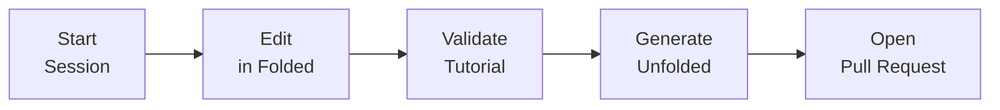

import Steps from '@/docs/components/mdx-components/Steps.astro'

Gitorial is an interactive coding tutorial format that uses Git commits as the "steps" of a narrative. Authoring is everything you do to create and refine those steps so learners experience a smooth, incremental journey.

## What authoring aims to solve

- **Easy step edits:** Make precise changes to any step without losing continuity across the tutorial.
- **Easy pull requests:** Package changes so reviewers see exactly which steps changed and why.

To make this work, we rely on two complementary representations of your tutorial:

- **Folded:** the “final” story - a linear chain of commits, one per step. This is where you edit.
- **Unfolded:** a file-system view - one folder per step, each containing the full repo for that point in time. This is a shadow used to structure PRs.

You won't actively switch between these two views during authoring. Unfolded behaves like a shadow state - hidden but necessary for proper alignment with Git and for producing step-structured PRs. See ["Unfolded vs Folded"](./folded-unfolded) for details on how they map to each other.

## End-to-End Authoring Flow

The following sequence describes how an author creates, edits, and publishes a Gitorial tutorial.

<Steps>

1. **Start an authoring session** 
   The extension prepares the authoring environment by utilizing git worktrees. Initially only a worktree for the Folded state gets created.

2. **Edit steps** 
   Authors make changes directly in the Folded view — for example, checking out and editing the commit for step _N_.
   Each edit modifies the underlying commit sequence that defines the tutorial timeline.

3. **Resolve conflicts (if any)** 
   If downstream steps depend on content that changed in an earlier step, the authoring interface will guide the user through resolving those conflicts one by one.

4. **Validate the story** 
   Once edits are complete, the author can preview the tutorial flow from start to finish.
   Validation may include running tests, executing build checks, or ensuring that each step logically follows from the previous one.

5. **Create PR-ready structure** 
   When the Gitorial is in a valid state, the author explicitly triggers a "Create PR-ready structure" action.
   This process expands the Folded state into an Unfolded representation, where each step is written to a corresponding `steps/N/` folder.  
   The generated structure lives locally and can be inspected before publication.

6. **Open a pull request** 
   Once satisfied, the author opens a PR for the unfolded state.

</Steps>
