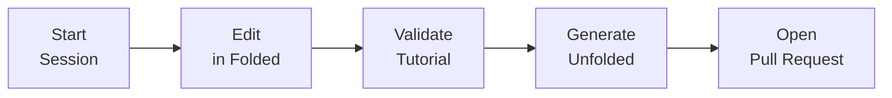

import Steps from '@/docs/components/mdx-components/Steps.astro'

Gitorial is an interactive coding tutorial format that uses Git commits as the "steps" of a narrative. Authoring is everything you do to create and refine those steps so learners experience a smooth, incremental journey.

## What authoring aims to solve

- **Easy step edits:** Make precise changes to any step without losing continuity across the tutorial.
- **Easy pull requests:** Package changes so reviewers see exactly which steps changed and why.

To make this work, we rely on two complementary representations of your tutorial:

- **Folded:** the “final” story - a linear chain of commits, one per step. This is where you edit.
- **Unfolded:** a file-system view - one folder per step, each containing the full repo for that point in time. This is a shadow used to structure PRs.

You won't actively switch between these two views during authoring. Unfolded behaves like a shadow state - hidden but necessary for proper alignment with Git and for producing step-structured PRs. See ["Unfolded vs Folded"](./folded-unfolded) for details on how they map to each other.

## End-to-End Authoring Flow

The following diagram shows the high-level flow. For the detailed, canonical instructions on editing steps, see [Editing Steps](/docs/authoring/3editing-steps).

