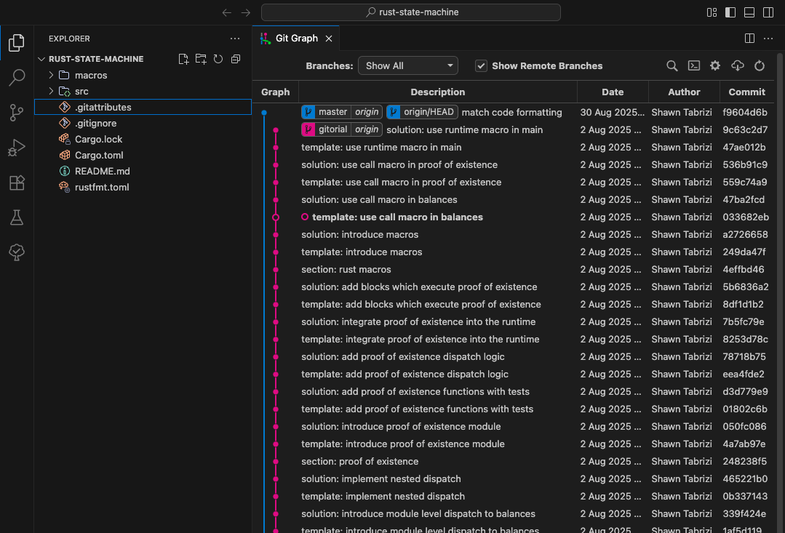
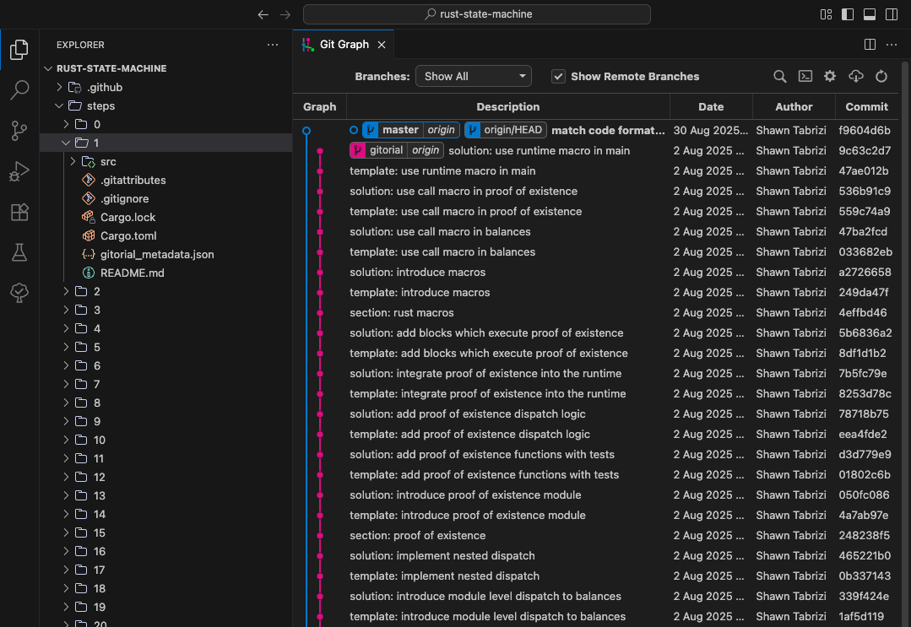

## Folded

The **Folded state** represents the tutorial as a linear sequence of commits.
Each commit captures a step, forming a consecutive timeline from start → finish.
This is the natural, reader-facing view of a Gitorial — and the environment where authors perform edits.



## Unfolded

The **Unfolded state** represents the same tutorial as a set of full repository snapshots — one folder per step (e.g., `step-07/`).
Each folder reflects the state of the project at that step in time.

The Unfolded view is **not** edited directly; it acts as a structural shadow used for pull requests and step-based code reviews.
When you trigger "Create PR-ready structure", the Folded timeline is materialized into Unfolded `step-N/` folders. Regenerate this structure when you want to refresh PR contents.



## Mapping Rules Between Folded and Unfolded

The relationship between the two states is **deterministic and reversible**:

- **Path mapping:** `folded(step N)` ↔ `unfolded/step-N/<path>`.
- **File changes:** modifications in Folded step N translate to diffs in `step-N`.
- **Adds/removes:** file creation or deletion in Folded is mirrored in the corresponding Unfolded step.
- **Metadata:** commit messages and supplemental data are stored in `gitorial_metadata.json`.

### Metadata Bridging

Because the Unfolded view alone cannot fully reconstruct commit metadata,
a companion file `gitorial_metadata.json` is introduced for each step:

```ts
interface GitorialMetadata {
  _Note: "This file will not be included in your final gitorial.";
  commitMessage: string;
}
```

This file is automatically generated and does not require manual edits.

## Edge cases

- **Renames:** treated as delete + add operations.
- **File duplication:** in the Unfolded state, each `step-N` folder contains a full copy of the repository at that step. This approach is conceptually simple but inefficient in terms of storage. Binary assets (e.g., images, videos) exacerbate this overhead. This is a known optimization target but will be intentionally deferred for development speed.

## Trade-offs

- **Simplicity vs. storage cost:** duplicating the full repository per step simplifies reasoning but increases disk usage.
- **Readable PRs vs. raw diffs:** by annotating which step changed, reviewers see tutorial-aligned diffs instead of opaque multi-commit changes.

 

## Suggested visuals to embed


